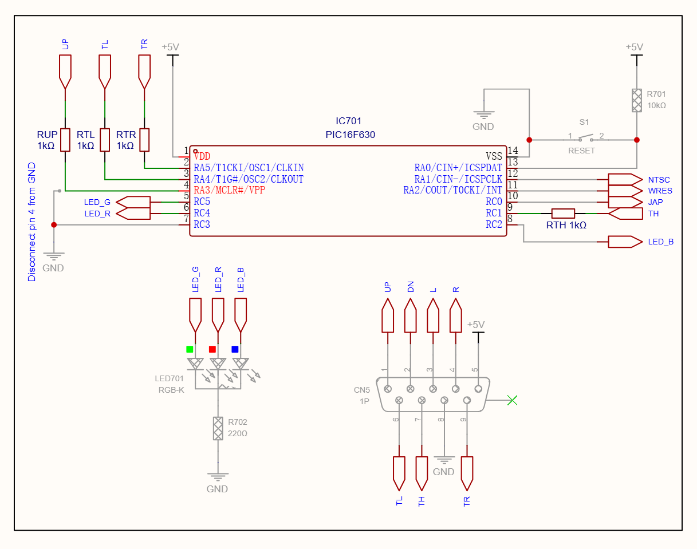

<a name="top"></a>

<a href="https://www.electroanalog.com">
  
</a>

# Neptune Smart Reset Button

[](LICENSE)
[](../../releases)
[]()
[]()

Neptune-SRB is an open-source Switchless region mod firmware for the **Cosam Neptune** board, providing electronic region selection for **Sega Genesis/Mega Drive** systems without dedicated region selection switches.  
It preserves compatibility with existing **Switchless Mod** installations while extending their functionality with new features.

## Table of Contents

- [Overview](#overview)
- [Building & Flashing](#building--flashing)
- [Installation Notes](#installation-notes)
- [In-Game Reset (IGR)](#in-game-reset-igr)
- [Configuration](#configuration)
- [About this Guide](#about-this-guide)

---

## Overview

Neptune-SRB includes integrated region selection, In-Game Reset (IGR) with automatic controller interface mode selection, Europe region VF switching (50/60Hz), enhanced RGB LED feedback, and persistent region configuration stored in the internal EEPROM.  
Designed for the PIC16F630 microcontroller, it uses a Timer0-driven architecture that provides deterministic timing and improved responsiveness.

### RGB LED Support

<details>
<summary> 🔴🟢🔵 LED color assignment for region presets can be customized - Click to expand</summary>

```c
// ** LED COLOR ASSIGNMENT **
#define COLOR_USA   LED_RED 
#define COLOR_JAP   LED_GREEN
#define COLOR_EUR   LED_YELLOW
```

</details>

> [!NOTE]
> The RGB LED color assignments are configurable at compile time by modifying the `COLOR_*` definitions.
>
> See [Configuration](#configuration) for the **Region LED Colors** section.

### Button Usage

The entire system is controlled using the console **RESET** button. Different press durations activate different functions.

| Button Action | Function |
|--------------|----------|
| **Short Press** (<300ms) | Reset the console |
| **Medium Press** (<1000ms) | Toggle 50Hz / 60Hz (Europe mode only) |
| **Long Press** (≥1000ms) | Select the next region (USA → Japan → Europe) |

> [!TIP]
> While the RESET button is held, the RGB LED previews each region every second.  
> Releasing the button applies the selected region and confirms the VF setting with a fast or slow blink (60/50Hz).

[🔝 Back to top](#top)

---

## Building & Flashing

### Source Code (Optional Compilation)
To build from source:
- Use [MPLAB X IDE](https://www.microchip.com/en-us/tools-resources/develop/mplab-x-ide) and [XC8 Compiler](https://www.microchip.com/en-us/tools-resources/develop/mplab-xc-compilers)
- Target microcontroller: **PIC16F630** or **PIC16F676**
- Clock: `4MHz` internal
- `MCLR` disabled (set as input)

### ⚡ Precompiled `.hex`
For convenience, two precompiled firmware variants **`.hex` file** are available in the [Releases](../../releases) section.  
This allows quick flashing using:

- **MPLAB IPE 6.20 or newer**
- **PICKit 3** or compatible programmer

Both the source code and precompiled `.hex` files are included in the repository.  

> [!NOTE]
> Thanks to the socketed DIP PIC16F630 used in existing Neptune installations, upgrading is usually as simple as replacing or reprogramming the microcontroller.
>
> If In-Game Reset (IGR) is **disabled** (`#define IGR_ENABLE 0`), no hardware modifications are required.  
> If IGR is **enabled** (`#define IGR_ENABLE 1`, default), additional connections to the controller port are required.
> <details>
> <summary>Controller Port 1 pins for IGR - Click to expand </summary>
> 
> - Pin 1 (UP)
> - Pin 6 (TL)
> - Pin 7 (TH)
> - Pin 9 (TR)
>
> </details>  
>
> See [Configuration](#configuration) and [Installation Notes](#installation-notes) for details.

[🔝 Back to top](#top)

---

## Installation Notes

Neptune-SRB is a drop-in replacement firmware for the original **Neptune Switchless Mod** hardware.  
RGB LED used in this project is a common cathode type. 

### Supported Platforms

- Cosam Neptune board
- Sega Genesis / Mega Drive

### PIC Pinout

The firmware is designed for the **PIC16F630** and **PIC16F676**, which share the same pinout and are fully interchangeable.

| Pin | Signal | Description |
|:---:|--------|-------------|
| 1 | **VDD** | +5V Supply |
| 2 | **RA5** | IGR TR input (Controller Port Pin 9) |
| 3 | **RA4** | IGR TL input (Controller Port Pin 6) |
| 4 | **RA3** | IGR UP input (Controller Port Pin 1) / ICSP MCLR/VPP |
| 5 | **RC5** | Green LED output |
| 6 | **RC4** | Red LED output |
| 7 | **RC3** | Not used |
| 8 | **RC2** | Blue LED output |
| 9 | **RC1** | IGR TH input (Controller Port Pin 7) |
| 10 | **RC0** | JAP Region output |
| 11 | **RA2** | RESET output |
| 12 | **RA1** | NTSC (50/60Hz) output / ICSP CLK |
| 13 | **RA0** | RESET button input / ICSP DAT |
| 14 | **VSS** | GND |

### Required Hardware Modifications for IGR

The In-Game Reset (IGR) feature requires four additional connections to the controller port that are not present in the original Switchless installation.  

| **PIC Pin No.** | **PIC I/O** | **1P Signal** | **1P Pin No.** |
|:---------------:|:-----------:|:-------------:|:--------------:|
| 2 | RA5 | TR | 9 |
| 3 | RA4 | TL | 6 |
| 4 | RA3 | UP | 1 |
| 9 | RC1 | TH | 7 |

> [!IMPORTANT]
> - Without the additional IGR wiring, all standard Switchless functions remain fully operational. In the absence of these connections, disabling the **IGR** feature in the firmware is recommended.
> - For Neptune board revisions up to r1.5, PIC pin **RA3** must be isolated from GND before connecting it to Controller Port Pin 1 (UP).
> - Otherwise, Controller Port Pin 1 (UP) **must not** be connected, as **RA3** will remain tied to GND, causing the **UP** input to remain permanently asserted and preventing normal controller operation.
>
> See [Configuration](#configuration) for the **Feature Enable** section.
### Cosam Neptune Switchless Mod Section Schematic

Reference schematic for Neptune boards up to the r1.5 release   

<a href="img/Schematic.png">
   
</a>  

Click the image to enlarge 
<br>


> [!NOTE]
> **1 kΩ** series resistors between the PIC controller inputs and the controller port are recommended to limit current during fault conditions while having negligible impact on normal operation. However, the firmware operates correctly without them, allowing existing Switchless installations to be upgraded without adding these resistors.

[🔝 Back to top](#top)

---

## In-Game Reset (IGR)

Neptune-SRB supports software reset directly from the controller, eliminating the need to reach the console's RESET button during gameplay.

| Controller | Button Combination |
|------------|--------------------|
| Sega Genesis / Mega Drive | **A + B + C + Start** |
| Sega Master System | **Up + B + C** |

The button combination must be held continuously for **1 second** before a reset is triggered.  
This duration is defined by `IGR_HOLD` (default: `1000` ms) and helps prevent accidental resets during normal gameplay.  

See [Configuration](#configuration) for the **User Timing Constants** section.  

> [!NOTE]
> The firmware continuously monitors the TH line to determine whether the controller port is operating in Genesis or Master System mode.
> The appropriate IGR button combination is then selected automatically, allowing seamless switching between game types (e.g. when using an EverDrive) without any user configuration.

### Technical Notes

- Controller interface mode is determined from the TH line state.
- TH multiplexing indicates Genesis mode; a static TH line indicates Master System mode.
- IGR timing is driven by the Timer0 interrupt for consistent operation.

[🔝 Back to top](#top)

---

## Configuration

Most Neptune-SRB behavior can be customized by editing the configuration macros near the beginning of the source code.

### Feature Enable

IGR support can be enabled or disabled at compile time.

```c
// FEATURE ENABLE
#define IGR_ENABLE    1      // 1 = Enable In-Game Reset, 0 = Disable
```

When disabled, the firmware provides the standard region switching functionality.  

### Region LED Colors

The RGB LED color assigned to each region can be customized by modifying the following definitions.

```c
// ** LED COLOR ASSIGNMENT **
#define COLOR_USA   LED_RED
#define COLOR_JAP   LED_GREEN
#define COLOR_EUR   LED_YELLOW
```

Available LED color definitions are:

- `LED_RED`
- `LED_GREEN`
- `LED_BLUE`
- `LED_YELLOW`
- `LED_CYAN`
- `LED_PURPLE`
- `LED_WHITE`

### User Timing Constants

The following constants control the user interface timing.

```c
// USER TIMING CONSTANTS
#define STD_PRESS   300     // ms
#define EXT_PRESS   1000    // ms
#define IGR_HOLD    1000    // ms
#define RST_PULSE   500     // ms
```

| Constant | Description |
|----------|-------------|
| `STD_PRESS` | Threshold between short and medium button presses for a standard RESET. |
| `EXT_PRESS` | Long-press threshold used to enter region selection mode. |
| `IGR_HOLD` | Required controller hold time before an IGR is triggered. |
| `RST_PULSE` | Duration of the hardware reset pulse. |


[🔝 Back to top](#top)

---

## About this Guide

This project is maintained by **Electroanalog** and is released as open-source firmware.

The goal of Neptune-SRB is to extend the functionality of the Neptune board while preserving compatibility with existing Switchless Mod installations.  

If you find this project useful, consider giving the repository a ⭐ on GitHub.  
It helps other retro gaming enthusiasts discover the project.

### License

This project is distributed under the **GNU General Public License v2.0 or later (GPL-2.0-or-later)**.  
You are free to use, modify, and redistribute this firmware under the terms of the GPL.

### Contributing

Bug reports, feature suggestions, and pull requests are always welcome.  
If you build your own Neptune-SRB installation, feedback and testing results are greatly appreciated.

---
## Credits

XC8 firmware implementation and new IGR logic by **Electroanalog® VICE** (2026)  
Based on the **[SAT-SRB (Saturn Smart Reset Button)](https://github.com/Electroanalog/SAT-SRB)** firmware architecture by **Electroanalog® VICE** (2025)

Developed for the **[Board-Folk's Neptune 32X/MD2](https://github.com/Board-Folk/Neptune)** hardware project.  
Pinout compatible with the original **[Switchless Mod](https://github.com/atomicretronl/switchless)** by **Steve Maddison**.  

*Sega Genesis, Mega Drive and Master System are registered trademarks of SEGA Corporation. All rights reserved.*

[🔝 Back to top](#top)

